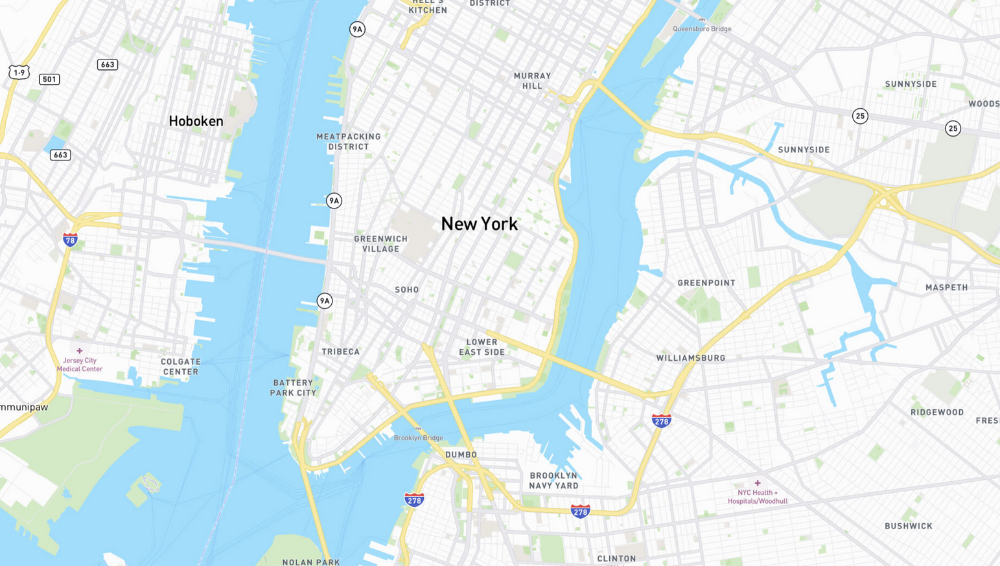

# Riders Platform

#### Aim of this platform is to give riders ability to explore towns by seeing others riders and spots.
#### First of all, we want to achieve minimal and super smooth functionality:
* Beeing able to explore and add new spots by their checks on map
* See other riders to know where to go and ride together(if they want, of course)
* Create events and make checks about it on map, so others could connect

From technical side:
* Keep code smooth and reliable, all should be clear
