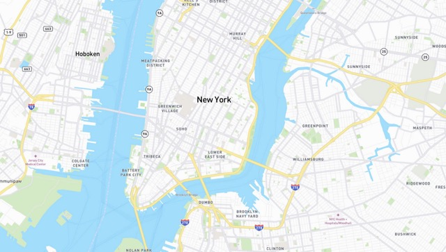

# Riders Platform

#### What aims we actually follow?
- Simple riders communication
- Abillity to explore new towns with only one click
- Creating events on spot, so others can see and could come here
- Share you position on map only with riders you want
#### What we got?
- Python Flask for API
- Haskell for WebSocket part(sharing coordinates)
- Simple asynchronious client written on python with PyGame emulation to
  understand how coordinates sharing should work to not overload channel communication
#### What we need?
- Cool frontend app, written without bunch of libs, just main parts:
  1. Map view with spots and riders
  2. Simple menu
  3. Sharing coordinates with WS protocol
- Unit tests for WS and API parts
- Prepare containers for deployment
#### How to run:
Build and run containers
> - docker compose up -d    

Connect to database and created schemas

> - psql -U postgres -h 0.0.0.0 -p 6432 (password: password)  
  \i api/rpserver/db/db_schema.sql 

Run in the browser
> - 0.0.0.0:8080
